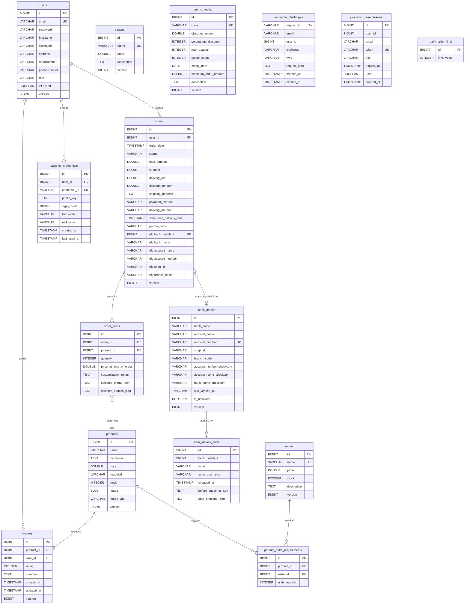

# KasiKotas — Complete Entity Relationship Diagram (ERD)

## Entity Relationship Diagram (Mermaid)



---

## Data Flow — How Everything Connects

### 1. User Registration & Login
```
users
  └── password_reset_tokens   (for OTP / forgot password flow)
  └── passkey_credentials     (for fingerprint / Face ID login)
  └── webauthn_challenges     (temporary challenge during passkey registration or login)
```

### 2. Placing an Order
```
users
  └── orders
        ├── order_items
        │     └── products          (price snapshotted at order time)
        │           └── extras      (selected extras stored as JSON in order_items)
        │           └── sauces      (selected sauces stored as JSON in order_items)
        ├── bank_details            (EFT only — account snapshotted onto order)
        └── promo_codes             (validated and discount applied server-side)
```

### 3. Product Catalogue
```
products
  └── product_extra_requirements   (defines which extras are REQUIRED per product)
        └── extras                 (the actual extra item with its own stock)
```

### 4. Reviews
```
users ──┐
        ├──► reviews ◄── products
```
One user can review one product once (unique constraint on product_id + user_id).

### 5. Security & Audit
```
bank_details
  └── bank_details_audit           (every CREATE / UPDATE / DELETE is logged)

users
  └── passkey_credentials          (stored public key after fingerprint enrollment)
  └── webauthn_challenges          (short-lived challenge rows, deleted after use)
  └── password_reset_tokens        (OTP tokens for password reset, expire after use)
```

### 6. Admin Controls
```
daily_order_limit                  (single row — admin sets max kotas per day)
promo_codes                        (admin creates discount codes)
bank_details                       (admin manages EFT accounts)
```

---

## Relationships Summary

| Table | Relates To | Type | Description |
|-------|-----------|------|-------------|
| users | orders | One-to-Many | A user places many orders |
| users | reviews | One-to-Many | A user writes many reviews |
| users | passkey_credentials | One-to-Many | A user can enroll multiple passkeys |
| orders | order_items | One-to-Many | An order contains many items |
| orders | bank_details | Many-to-One | EFT orders reference one bank account |
| order_items | products | Many-to-One | Each item references one product |
| products | reviews | One-to-Many | A product receives many reviews |
| products | product_extra_requirements | One-to-Many | A product can require many extras |
| extras | product_extra_requirements | One-to-Many | An extra can be required by many products |
| bank_details | bank_details_audit | One-to-Many | Every change to bank details is audited |

---

## Key Design Decisions

- **EFT Bank Details Snapshot** — When an EFT order is placed, the bank account details
  (name, number, branch code) are copied directly onto the order row. This means even if
  the admin later changes or deletes the bank account, the original payment details are
  preserved on the order forever.

- **Extras & Sauces as JSON** — Selected extras and sauces per order item are stored as
  JSON strings (`selected_extras_json`, `selected_sauces_json`) rather than separate join
  tables. This keeps the schema simple while still capturing the full selection at order time.

- **Passkey Challenges are Temporary** — `webauthn_challenges` rows are deleted immediately
  after they are consumed (used once). They also expire after 5 minutes if unused.

- **Reviews are Unique per User per Product** — A database unique constraint on
  `(product_id, user_id)` ensures one review per user per product.

- **Daily Order Limit is a Single Row** — `daily_order_limit` holds one record that the
  admin updates. It is read with a pessimistic lock during order creation to prevent
  race conditions.

- **Optimistic Locking** — `users`, `orders`, `products`, `extras`, `sauces`, `promo_codes`,
  `bank_details`, and `reviews` all have a `version` column for optimistic locking.
